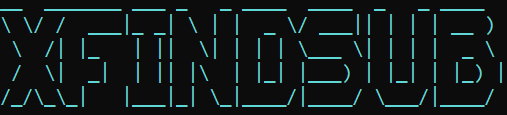

<p align="center">
  
</p>

<p align="center">
  <b>XFINDSUB</b> is a passive subdomain enumeration tool with a clean and interactive CLI interface.<br>
  Powered by <a href="https://github.com/Textualize/rich">rich</a> + <a href="https://pypi.org/project/pyfiglet/">pyfiglet</a>.
</p>

<p align="center">
  <a href="https://github.com/Auto-runs/Auto-runs-XFINDSUB/stargazers">
    
  </a>
  <a href="https://github.com/Auto-runs/Auto-runs-XFINDSUB/issues">
    
  </a>
  <a href="https://github.com/Auto-runs/Auto-runs-XFINDSUB/blob/main/LICENSE">
    
  </a>
  
</p>

---

## ✨ Features
- 🔍 Passive subdomain enumeration from:
  - [crt.sh](https://crt.sh)
  - [AlienVault OTX](https://otx.alienvault.com)
  - [Bufferover](https://dns.bufferover.run)
- ✅ Optional DNS resolution (check if subdomains are alive)
- 📂 Output to `stdout`, `TXT`, or `JSON`
- 🎨 Fancy CLI interface (banner + spinner progress)
- ⚡ Supports single domain or multiple domains (via list file)

---
<p align="center">  </p>

## ⚙️ Installation
```bash
git clone https://github.com/Auto-runs/XFINDSUB.git

cd Auto-runs-XFINDSUB

pip install -r requirements.txt
 
```
## 📌 Usage
```bash
🔹 Single domain

python xfindsub.py -d example.com
```
```bash
🔹 List of domains

python xfindsub.py -l domains.txt
```
```bash
🔹 With DNS resolution

python xfindsub.py -d example.com --resolve
```
```bash
🔹 Output results (TXT)

python xfindsub.py -d example.com -o result.txt
```
```bash
🔹 Output results (JSON)

python xfindsub.py -d example.com --json result.json
```
```bash
🔹 Silent mode (only print subdomains)

python xfindsub.py -d example.com --silent
```
```bash
🔹 Custom sources

python xfindsub.py -d example.com --sources crtsh,otx
```

📌 Example Output
```bash
XFINDSUB - Passive Subdomain Finder

[+] Target  : facebook.com
[+] Sources : crtsh, otx, bufferover
[+] Resolve : ON

[+] Found subdomains:
- m.facebook.com
- developers.facebook.com
- business.facebook.com
- upload.facebook.com
- static.facebook.com
```

⚠️ Disclaimer

This tool is developed for educational and research purposes only.
Use it solely on domains that you are authorized to test.
I (the author) am not responsible for any misuse of this tool.
